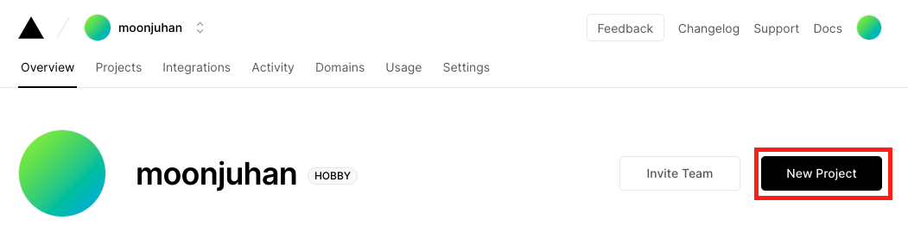
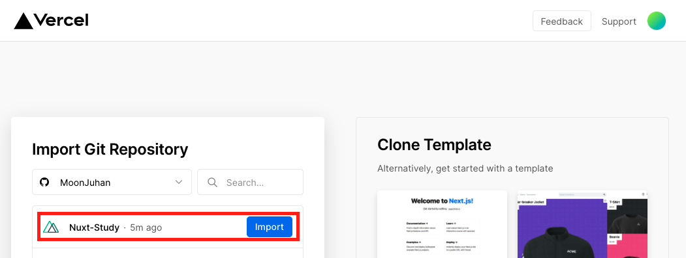
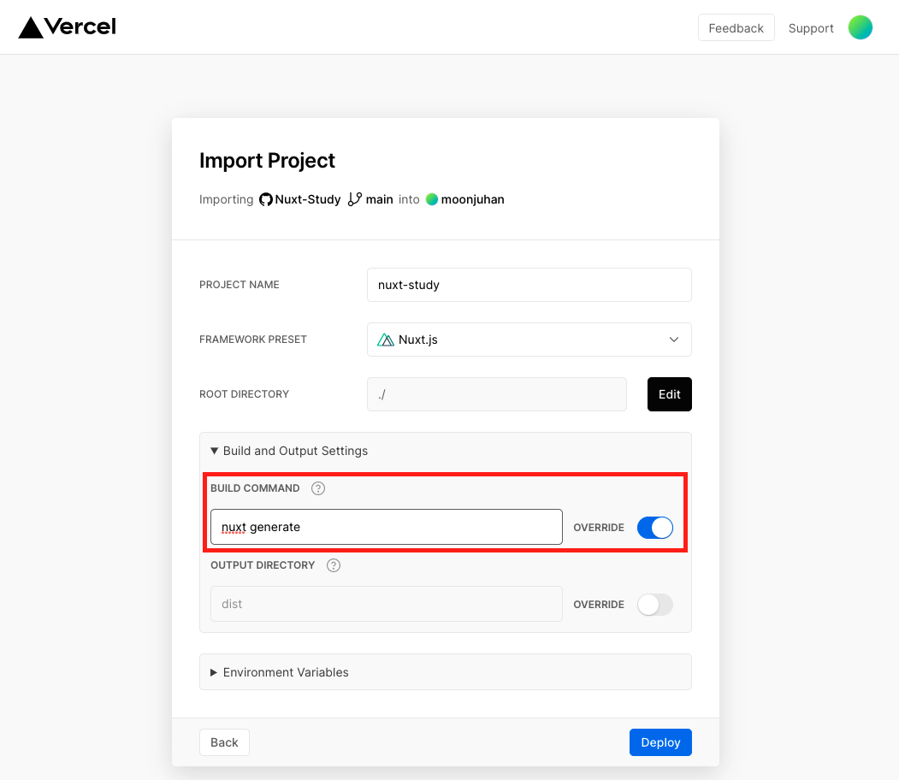
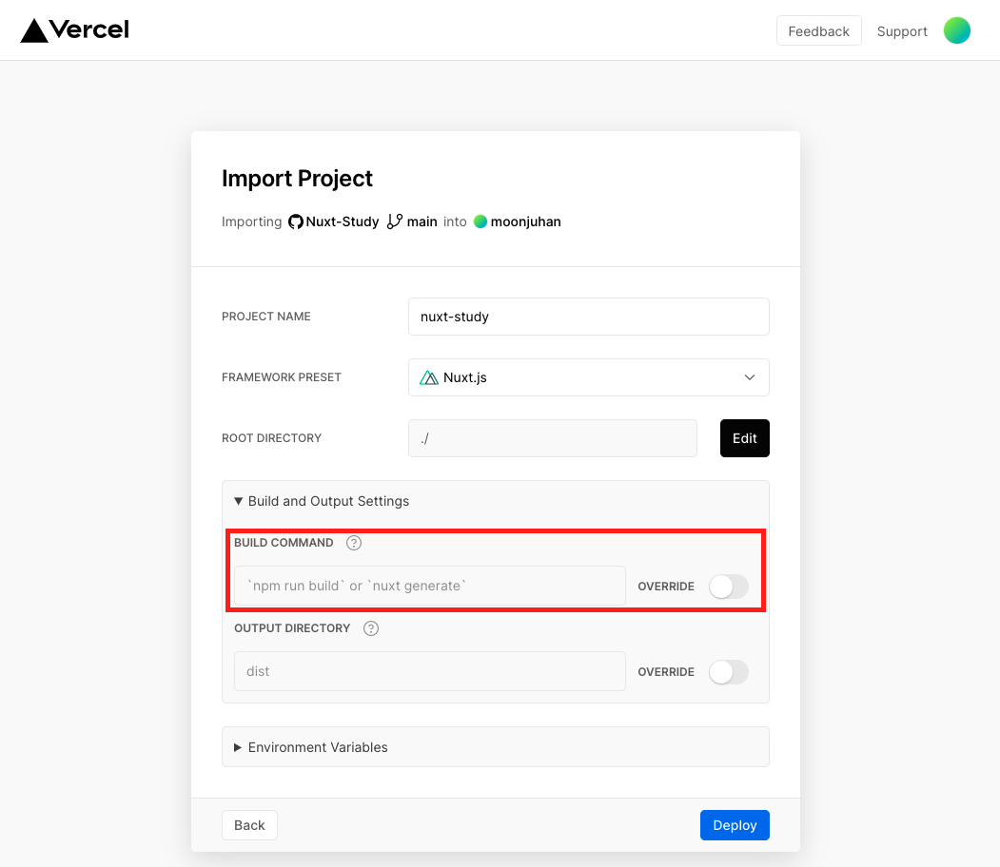

# Nuxt.js + Vercel Deploy

Vercel을 사용한 Nuxt.js 프로젝트 배포

자주 사용하던 Netlify가 아닌 Vercel을 선택한 이유는 Netlify는 정적 배포만 지원하고,
Vercel이 정적, SSR 배포 모두 지원하기 때문입니다.

---

## Static Build Deploy

> 정적 빌드 배포

1. Vercel 프로젝트 추가



2. Vercel 깃허브 프로젝트 선택



3. Nuxt.js 빌드 커맨드 변경



---

## SSR Build Deploy

> SSR 빌드 배포

1. Nuxt.js vercel-build 설치

```
npm i @nuxtjs/vercel-builder
```

2. 루트 위치에 vercel.json 추가

```
{
  "version": 2,
  "builds": [
    {
      "src": "nuxt.config.js",
      "use": "@nuxtjs/vercel-builder"
    }
  ]
}

```

3. yarn install 시 오류 발생하지 않게 확인 후 깃허브에 푸시

4. 정적 빌드 배포와 동일하게 프로젝트 설정 진행

5. Nuxt.js 빌드 커맨드 변경 없이 배포



## 학습 참고 링크

### [Nuxt.js 공식 문서 - Vercel 배포](https://nuxtjs.org/docs/2.x/deployment/vercel-deployment)

### [Vercel 공식 문서 - Nuxt.js 배포](https://vercel.com/guides/deploying-nuxtjs-with-vercel)

### [nuxt/vercel-builder 깃허브](https://github.com/nuxt/vercel-builder)
